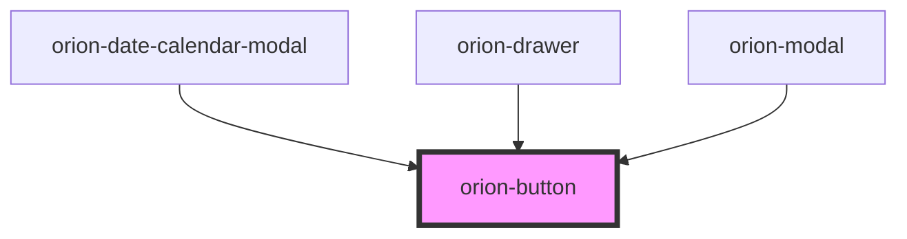

# orion-button

Button is a clickable element that can be used to trigger actions.

Additional documentation available at [orion.united.com](https://orion.united.com/)

<!-- Auto Generated Below -->

## Properties

| Property       | Attribute       | Description                                                    | Type                                     | Default       |
| -------------- | --------------- | -------------------------------------------------------------- | ---------------------------------------- | ------------- |
| `disabled`     | `disabled`      | The disabled state                                             | `boolean`                                | `false`       |
| `iconName`     | `icon-name`     | The icon name                                                  | `string`                                 | `''`          |
| `iconRight`    | `icon-right`    | The icon position                                              | `boolean`                                | `false`       |
| `small`        | `small`         | The small state                                                | `boolean`                                | `false`       |
| `sticky`       | `sticky`        | The sticky state. A default button will display on desktop.    | `boolean`                                | `false`       |
| `stickyMobile` | `sticky-mobile` | The sticky state for mobile only. Button will hide on desktop. | `boolean`                                | `false`       |
| `type`         | `type`          | The button type                                                | `"button" \| "reset" \| "submit"`        | `'button'`    |
| `variant`      | `variant`       | The button variant                                             | `"primary" \| "secondary" \| "tertiary"` | `'secondary'` |

## CSS Custom Properties

| Name                    | Description                         |
| ----------------------- | ----------------------------------- |
| `--orion-button-radius` | value of the border-radius property |
| `--orion-button-width`  | value of the width property         |

## Dependencies

### Used by

 - [orion-date-calendar-modal](../orion-date-input/orion-date-calendar-modal)
 - [orion-drawer](../orion-drawer)
 - [orion-modal](../orion-modal)

### Graph

----------------------------------------------

*Built with [StencilJS](https://stenciljs.com/)*
