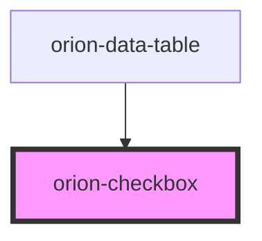

# orion-checkbox

Checkbox is a component that allows users to select one or more options from a set. Use in conjunction with the `orion-checkbox-group` component to control layout. Use in conjunction with `orion-label`, `orion-error` and `orion-note` components.

Additional documentation available at [orion.united.com](https://orion.united.com/)

<!-- Auto Generated Below -->

## Properties

| Property        | Attribute       | Description                                                                      | Type      | Default |
| --------------- | --------------- | -------------------------------------------------------------------------------- | --------- | ------- |
| `checked`       | `checked`       | The checked state of the checkbox                                                | `boolean` | `false` |
| `disabled`      | `disabled`      | Disables interactions                                                            | `boolean` | `false` |
| `indeterminate` | `indeterminate` | The indeterminate state of the checkbox (overridden by checked if both are true) | `boolean` | `false` |
| `name`          | `name`          | The input name                                                                   | `string`  | `''`    |
| `required`      | `required`      | Required attribute                                                               | `boolean` | `false` |
| `value`         | `value`         | The input value                                                                  | `string`  | `''`    |

## Events

| Event          | Description                                | Type                                                |
| -------------- | ------------------------------------------ | --------------------------------------------------- |
| `valueChanged` | CustomEvent `detail` will be the new value | `CustomEvent<{ value: string; checked: boolean; }>` |

## Slots

| Slot        | Description                         |
| ----------- | ----------------------------------- |
| `"default"` | default slot for the checkbox label |

## CSS Custom Properties

| Name                               | Description                                                                           |
| ---------------------------------- | ------------------------------------------------------------------------------------- |
| `--orion-checkbox--vertical-align` | Alignment of checkbox label. Default is flex-start. Can be set to center or flex-end. |

## Dependencies

### Used by

 - [orion-data-table](../orion-data-table)

### Graph

----------------------------------------------

*Built with [StencilJS](https://stenciljs.com/)*
