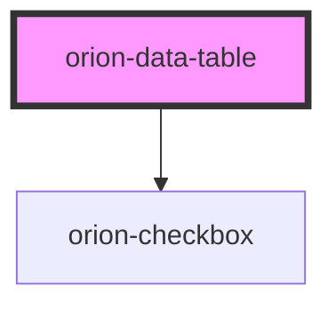

# orion-data-table

<!-- Auto Generated Below -->

## Properties

| Property        | Attribute  | Description                                                  | Type                          | Default     |
| --------------- | ---------- | ------------------------------------------------------------ | ----------------------------- | ----------- |
| `checkbox`      | `checkbox` | Adds in a checkbox column to the left hand side of the table | `boolean`                     | `false`     |
| `headers`       | --         | An array of column headers                                   | `(string \| ComplexHeader)[]` | `[]`        |
| `hiddenColumns` | --         | Hides columns by index                                       | `number[]`                    | `[]`        |
| `pin`           | `pin`      | Pins n columns to the left hand side of the table            | `number`                      | `0`         |
| `rows`          | --         | A 2D array for row data                                      | `Row[]`                       | `[]`        |
| `sortable`      | `sortable` | Controls whether the table should be sortable or not         | `boolean`                     | `false`     |
| `variant`       | `variant`  | Visual variant for table                                     | `"lined" \| "striped"`        | `'striped'` |

## Events

| Event                        | Description                                                  | Type                                                                                |
| ---------------------------- | ------------------------------------------------------------ | ----------------------------------------------------------------------------------- |
| `orionCheckboxColumnToggled` | Emits event when a column header's toggle is pressed         | `CustomEvent<{ columnIndex: number; toggledTo: boolean; }>`                         |
| `orionTableUpdated`          | Emits event when a checkbox or select has it's value changed | `CustomEvent<{ columnIndex: number; rowIndex: number; updatedRow: innerRowData; }>` |

## CSS Custom Properties

| Name                                      | Description                                                         |
| ----------------------------------------- | ------------------------------------------------------------------- |
| `--orion-table-checkbox-border`           | horizontal border for checkbox columns                              |
| `--orion-table-column-min-width`          | min-width for columns                                               |
| `--orion-table-even-row-background`       | background color for even rows (ignored if table is lined)          |
| `--orion-table-even-row-background-hover` | background color on hover for even rows (ignored if table is lined) |
| `--orion-table-odd-row-background`        | background color for odd rows                                       |
| `--orion-table-odd-row-background-hover`  | background color on hover for odd rows                              |
| `--orion-table-pinned-column-border`      | right-side border for pinned column                                 |
| `--orion-table-select-column-min-width`   | min-width for columns that use a dropdown select                    |
| `--orion-table-width`                     | width for the inner table component                                 |

## Dependencies

### Depends on

- [orion-checkbox](../orion-checkbox)

### Graph

----------------------------------------------

*Built with [StencilJS](https://stenciljs.com/)*
