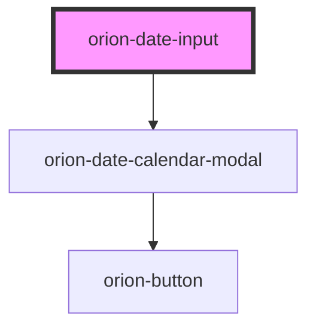

# orion-date-input

Date inputs allow the user to enter a single date or a range between two dates.. Additional documentation available at [orion.united.com](https://orion.united.com/)

<!-- Auto Generated Below -->

## Properties

| Property      | Attribute     | Description                                                                                          | Type                          | Default        |
| ------------- | ------------- | ---------------------------------------------------------------------------------------------------- | ----------------------------- | -------------- |
| `dateFormat`  | `date-format` | Format to be used by the date inputs & calendar Follows spec at https://flatpickr.js.org/formatting/ | `string`                      | `'m/d/Y'`      |
| `disabled`    | `disabled`    | Disabled state of input                                                                              | `boolean`                     | `false`        |
| `error`       | `error`       | Error state of input                                                                                 | `boolean`                     | `false`        |
| `inline`      | `inline`      | Shows the first-label inline with the input                                                          | `boolean`                     | `false`        |
| `maxDate`     | `max-date`    | Inclusive maximum date (time is removed from limit)                                                  | `Date \| string \| undefined` | `undefined`    |
| `minDate`     | `min-date`    | Inclusive minimum date (time is removed from limit)                                                  | `Date \| string \| undefined` | `undefined`    |
| `multiMonth`  | `multi-month` | Makes the calendar show two months                                                                   | `boolean`                     | `false`        |
| `placeholder` | `placeholder` | Placeholder for the date inputs                                                                      | `string`                      | `'mm/dd/yyyy'` |
| `range`       | `range`       | Shows two inputs, and calendar is in range mode                                                      | `boolean`                     | `false`        |

## Events

| Event               | Description                                             | Type                                                                           |
| ------------------- | ------------------------------------------------------- | ------------------------------------------------------------------------------ |
| `orionDateSelected` | Emits 'orionDateSelected' event when a date is selected | `CustomEvent<{ startDate?: Date \| undefined; endDate?: Date \| undefined; }>` |

## Slots

| Slot                              | Description                   |
| --------------------------------- | ----------------------------- |
| `"orion-date-input-first-label"`  | slot for first input's label  |
| `"orion-date-input-second-label"` | slot for second input's label |

## CSS Custom Properties

| Name                                  | Description                                                                                 |
| ------------------------------------- | ------------------------------------------------------------------------------------------- |
| `--orion-date-input-focus-box-shadow` | Box shadow of the date input when focused. Defaults to 0 0 0 4px rgba(241, 241, 240, 0.25). |
| `--orion-date-input-hover`            | Background color of the date input when hovered. Defaults to #eaeaf3.                       |
| `--orion-date-input-max-width`        | Maximum width of the date input. Defaults to 398px.                                         |
| `--orion-date-input-min-width`        | Minimum width of the date input. Defaults to 140px.                                         |

## Dependencies

### Depends on

- [orion-date-calendar-modal](orion-date-calendar-modal)

### Graph

----------------------------------------------

*Built with [StencilJS](https://stenciljs.com/)*
