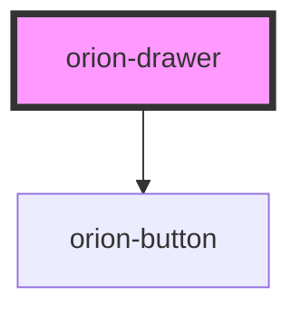

# orion-drawer

Drawer is a component that allows users to display content in a temporary sidebar.

Additional documentation available at [orion.united.com](https://orion.united.com/)

<!-- Auto Generated Below -->

## Properties

| Property   | Attribute   | Description                                    | Type                            | Default   |
| ---------- | ----------- | ---------------------------------------------- | ------------------------------- | --------- |
| `isOpen`   | `is-open`   | Prop used to show/hide drawer                  | `boolean`                       | `false`   |
| `openFrom` | `open-from` | Animates drawer in from left, right, or bottom | `"bottom" \| "left" \| "right"` | `'right'` |

## Events

| Event                         | Description                                 | Type                                |
| ----------------------------- | ------------------------------------------- | ----------------------------------- |
| `orionDrawerFooterBtnClicked` | Emits event when footer buttons are clicked | `CustomEvent<{ variant: string; }>` |

## Slots

| Slot                              | Description               |
| --------------------------------- | ------------------------- |
| `"orion-drawer-body"`             | slot for body content     |
| `"orion-drawer-footer-content"`   | slot for footer content   |
| `"orion-drawer-primary-button"`   | slot for primary button   |
| `"orion-drawer-secondary-button"` | slot for secondary button |
| `"orion-drawer-title"`            | slot for title            |

## CSS Custom Properties

| Name                          | Description                                                             |
| ----------------------------- | ----------------------------------------------------------------------- |
| `--orion-drawer-bg-color`     | background color of drawer. Default is #fff                             |
| `--orion-drawer-color`        | color of drawer text. Default is #333                                   |
| `--orion-drawer-max-width-lg` | max width of drawer on large screens (1441px and above). Default is 33% |
| `--orion-drawer-max-width-md` | max width of drawer on medium screens (1025px - 1440px). Default is 40% |
| `--orion-drawer-max-width-sm` | max width of drawer on small screens (769px - 1024px). Default is 50%   |
| `--orion-drawer-top-value`    | top starting position of drawer                                         |

## Dependencies

### Depends on

- [orion-button](../orion-button)

### Graph

----------------------------------------------

*Built with [StencilJS](https://stenciljs.com/)*
