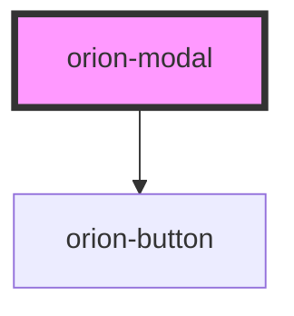

# orion-modal

Modal is a component that displays a modal dialog. It is used to display content that requires user interaction.

Additional documentation available at [orion.united.com](https://orion.united.com/)

<!-- Auto Generated Below -->

## Properties

| Property                  | Attribute                   | Description                                                        | Type      | Default |
| ------------------------- | --------------------------- | ------------------------------------------------------------------ | --------- | ------- |
| `hasCancelIcon`           | `has-cancel-icon`           | Toggles visibility of the close icon in the top right of the modal | `boolean` | `false` |
| `hasIcon`                 | `has-icon`                  | Adds an icon to the modal header                                   | `boolean` | `false` |
| `iconName`                | `icon-name`                 | Name of the icon to be added to the modal header                   | `string`  | `''`    |
| `isFullscreen`            | `is-fullscreen`             | Set this to have the modal take up the full screen                 | `boolean` | `false` |
| `isFullscreenMobile`      | `is-fullscreen-mobile`      | Set this to have the modal take up the full screen on mobile only  | `boolean` | `false` |
| `isOpen`                  | `is-open`                   | Toggles the visibility of the modal                                | `boolean` | `false` |
| `isTitleCentered`         | `is-title-centered`         | Set this to center-align the modal title                           | `boolean` | `false` |
| `primaryButtonDisabled`   | `primary-button-disabled`   | Disables the primary button                                        | `boolean` | `false` |
| `secondaryButtonDisabled` | `secondary-button-disabled` | Disables the secondary button                                      | `boolean` | `false` |

## Events

| Event                        | Description                                                     | Type                                |
| ---------------------------- | --------------------------------------------------------------- | ----------------------------------- |
| `modalClose`                 | Emits `modalClose` event when isOpen is set to false internally | `CustomEvent<any>`                  |
| `orionModalFooterBtnClicked` | Emits event when footer buttons are clicked                     | `CustomEvent<{ variant: string; }>` |

## Slots

| Slot                             | Description                                                                                                                                                                                                           |
| -------------------------------- | --------------------------------------------------------------------------------------------------------------------------------------------------------------------------------------------------------------------- |
| `"orion-modal-body"`             | slot for body content                                                                                                                                                                                                 |
| `"orion-modal-button-row"`       | slot for content in the button row. Displays to the left of the primary and secondary buttons in desktop and to the bottom in mobile. This slot only exists if the primary and/or secondary buttons are also present. |
| `"orion-modal-footer-center"`    | slot for center aligned footer content                                                                                                                                                                                |
| `"orion-modal-footer-left"`      | slot for left aligned footer content                                                                                                                                                                                  |
| `"orion-modal-footer-right"`     | slot for right aligned footer content                                                                                                                                                                                 |
| `"orion-modal-primary-button"`   | slot for primary button                                                                                                                                                                                               |
| `"orion-modal-secondary-button"` | slot for secondary button                                                                                                                                                                                             |
| `"orion-modal-title"`            | slot for title                                                                                                                                                                                                        |

## CSS Custom Properties

| Name                                 | Description                                                                                                                                       |
| ------------------------------------ | ------------------------------------------------------------------------------------------------------------------------------------------------- |
| `--orion-modal-footer-divider-color` | value of the custom footer divider color. Default value is var(--orion-gray-40, #999).                                                            |
| `--orion-modal-height-desktop`       | value of the height property. Default value is auto. Value can be in px, percentage or vh.                                                        |
| `--orion-modal-height-mobile`        | value of the height property. Default value is auto. Value can be in px, percentage or vh.                                                        |
| `--orion-modal-max-height-desktop`   | value of the max-height property. Default value is 50vh. Value can be in px, percentage or vh.                                                    |
| `--orion-modal-max-height-mobile`    | value of the max-height property. Default value is 480px. Value can be in px, percentage or vh. Recommend do not exceed 667px (iPhone SE height). |

## Dependencies

### Depends on

- [orion-button](../orion-button)

### Graph

----------------------------------------------

*Built with [StencilJS](https://stenciljs.com/)*
